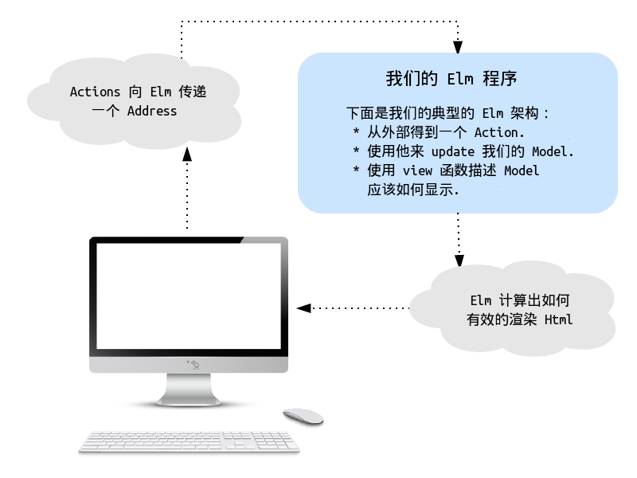

# Elm 架构

这个教程是”Elm架构”概述。你会看到所有[Elm]()程序，不管是[TodoMVC]()，[dreamwriter]()，还是在[NoRedInk]()和[CircuitHub]()等产品中运行的程序都能找得到。这个基本模式在写前端程序时十分有用，无论是用Elm或js或是其他。

[Elm]: http://elm-lang.org/
[TodoMVC]: https://github.com/evancz/elm-todomvc
[dreamwriter]: https://github.com/rtfeldman/dreamwriter#dreamwriter
[NoRedInk]: https://www.noredink.com/
[CircuitHub]: https://www.circuithub.com/

Elm架构是一个无限嵌套组件的简单模式。对于模块化开发，代码重构，测试都有着重大意义。最终，这个模式使创建模块化复杂的web应用变的很简单。我们将通过8个实例，深入理解该模式与其核心原则：

  1. [计数器](http://evancz.github.io/elm-architecture-tutorial/examples/1.html)
  2. [一对计数器](http://evancz.github.io/elm-architecture-tutorial/examples/2.html)
  3. [计数器列表](http://evancz.github.io/elm-architecture-tutorial/examples/3.html)
  4. [计数器列表（改）](http://evancz.github.io/elm-architecture-tutorial/examples/4.html)
  5. [GIF获取器](http://evancz.github.io/elm-architecture-tutorial/examples/5.html)
  6. [一对GIF获取器](http://evancz.github.io/elm-architecture-tutorial/examples/6.html)
  7. [GIF获取器列表](http://evancz.github.io/elm-architecture-tutorial/examples/7.html)
  8. [两个正方形动画](http://evancz.github.io/elm-architecture-tutorial/examples/8.html)

这个教程非常有用，他将带给我们必要的概念和思路，这使得实例7和实例8的实现变的简单（7，8是较难掌握的两个例子，分别对应了处理异步请求Async和动画效果Animation的方法论）。投资肯定是值得的。

所有这些程序中一个非常有趣的地方是，Elm的实现方式非常自然。无论你是否读过这篇文档和知道他特点，语言设计本身就会引领你深入这一架构。事实上，我已被Elm对这种模式实现简单性与威力所深深震撼。

**注意**：想要查看本指南的源代码，要[安装Elm](http://elm-lang.org/install)和fork这个项目。**examples**中的每个实例都告诉了你要如何运行代码。

## 基本模式

每个Elm程序可以明确分解为三个部分：

  * model （模型）
  * update （动作）
  * view （视图）

你可以从下面基本形式开始，为每部分扩展代码。

> 如果第一次接触Elm代码，[language docs](http://elm-lang.org/docs)这篇文档涵盖了从语法到函数式编程风格的指南，完成阅读指南的前两节就可以快速掌握它！

```elm
-- MODEL

type alias Model = { ... }


-- UPDATE

type Action = Reset | ...

update : Action -> Model -> Model
update action model =
  case action of
    Reset -> ...
    ...


-- VIEW

view : Model -> Html
view =
  ...
```

本教程全程都在讲解这个模式的详尽用法，并在上面形式上逐步的扩展代码。

## 实例1：计数器

**[demo地址](http://evancz.github.io/elm-architecture-tutorial/examples/1.html) / [代码地址](examples/1/)**

我们的第一个例子是一个简单的计数器，他可以递增或递减。

[代码](examples/1/Counter.elm)开始于一个非常简单的model。我们只需要计算一个数字：

```elm
type alias Model = Int
```

当涉及到更新我们的model时，比较简单了。我们定义了一组可执行的actions，和一个`update`函数来执行这些actions：

```elm
type Action = Increment | Decrement

update : Action -> Model -> Model
update action model =
  case action of
    Increment -> model + 1
    Decrement -> model - 1
```

注意我们的`Action`[类型]()，他没有**做**其他任何事。他只是简单的描述了action操作（Increment和Decrement分别表示递增和递减）。如果某人想要在按下按钮时，让我们的计数器以双倍计数，那么这又会是一个新的`Action`。代码很清楚的描述了model是如何转变的。任何人阅读这段代码后都会马上知道他会做什么，他能做什么。此外，也将知道添加新功能的方式。

[类型]: http://elm-lang.org/learn/Union-Types.elm

最后，我们创建一个`view`方法用来展示我们的`Model`。并使用[elm-html]()在浏览器中显示HTML。我们创建一个div容器，他包括一个递增按钮，一个div用来显示当前的值，和一个递减按钮。

[elm-html]: http://elm-lang.org/blog/Blazing-Fast-Html.elm

```elm
view : Signal.Address Action -> Model -> Html
view address model =
  div []
    [ button [ onClick address Decrement ] [ text "-" ]
    , div [ countStyle ] [ text (toString model) ]
    , button [ onClick address Increment ] [ text "+" ]
    ]

countStyle : Attribute
countStyle =
  ...
```

The tricky thing about our `view` function is the `Address`. We will dive into that in the next section! For now, I just want you to notice that **this code is entirely declarative**. We take in a `Model` and produce some `Html`. That is it. 

At no point do we mutate the DOM manually, which gives the library [much more freedom to make clever optimizations][elm-html] and actually makes rendering *faster* overall. 

It is crazy. Furthermore, `view` is a plain old function so we can get the full power of Elm&rsquo;s module system, test frameworks, and libraries when creating views.

`Address`是`view`中不好理解的一个概念，我们将在下一节中深入讨论他！现在我只想让你知道，**这段代码完全是声明式的**。一个`Model`会对应产生一些`Html`。总的来说，任何时候我们手动修改dom，这给了库更大的自由度去实现优化，渲染也会**更快**。此外，视图是一个纯函数，所以我们可以得到一个强大的模块系统，测试框架和一些库，当创建一个views时。

这个模式是构建Elm程序的本质。从现在开始，我们看到每个实例都是围绕`Model`，`update`,`view`对基本模式的扩展。


## 启动程序

很多Elm程序都有一小段代码来启动整个应用程序。本指南中的实例中，主要代码会被放在一个叫做`Main.elm`的文件中。拿我们计数器来说，这段代码看起来像下面这样：

```elm
import Counter exposing (update, view)
import StartApp.Simple exposing (start)

main =
  start { model = 0, update = update, view = view }
```

我们使用[`StartApp`](https://github.com/evancz/start-app)库来将model，update和view函数组织在一起。这个库是对[signals](http://elm-lang.org/learn/Using-Signals.elm)库的简单包装，所以你不必对他深入理解。

`Address`是连接程序的一个关键概念。我们`view`中的每个事件都会抛出一个特定的address。address只用来发送数据。`StartApp`库监控来自的address的信息，并将他们反馈到`update`函数。这时`model`就会更新，[elm-html][]会将变化进行有效的渲染。


这意味着在Elm中数据流动是单向的，像下面这样：



蓝色部分就是Elm的核心内容，也就是我们一直在讨论的model/update/view模式。多想想这个蓝色盒子，就可以在Elm实践中取得很大进步。

注意这里我们并没有**执行** actions，因为他们被发送回我们的程序。我们仅仅发送了一些数据。这种分离实现是一个关键细节，他保持我们的逻辑完全独立于view。

## 实例 2: 一对计数器

**[示例地址](http://evancz.github.io/elm-architecture-tutorial/examples/2.html) / [代码地址](examples/2/)**

在示例1中我们创建了一个基本的计数器。当我们需要*两个*计数器时，该如何进行扩展？能做到模块化么开发么？

如果能重复使用示例1,岂不是很好？Elm架构极好的一点是，**可以重用代码而无需考虑其他变化**。示例1创建一个`Counter`模块，他封装了所有的细节实现，所以我们可以在别的地方使用：

```elm
module Counter (Model, init, Action, update, view) where

type Model

init : Int -> Model

type Action

update : Action -> Model -> Model

view : Signal.Address Action -> Model -> Html
```

模块化代码是一个强大的抽象。我们希望通过模块系统适当的暴露功能或隐藏其部分实现。除了`Counter`模块本身，我们只能看到基本的`Model`，`init`，`Action`，`update`和`view`。我们并不需要去关心他们内部是如何实现的。实际上，依赖于私有的实现细节是*不可能*的。

所以可以重复利用`Counter`模块，现在我们需要用他来构建我们的`CounterPair`。一如既往，从`Model`开始：

```elm
type alias Model =
    { topCounter : Counter.Model
    , bottomCounter : Counter.Model
    }

init : Int -> Int -> Model
init top bottom =
    { topCounter = Counter.init top
    , bottomCounter = Counter.init bottom
    }
```

`Model`是一个含有两个字段的记录，用于将每个计数器显示在屏幕上。这充分说明了所有应用程序的状态。我们也有一个`init`函数用来创建我们新的`Model`。

接下来，描述我们想要实现的`Actions`。这回功能应该是：重置所有计数器，更新上边的计数器，或更新下边的计数器三个。

```elm
type Action
    = Reset
    | Top Counter.Action
    | Bottom Counter.Action
```

注意，这里的[类型]()是`Counter.Action`类型，但是我们并不知道他的的实现细节。创建`update`函数时，只需要实现将这些`Counter.Actions`发往正确的位置：

```elm
update : Action -> Model -> Model
update action model =
  case action of
    Reset -> init 0 0

    Top act ->
      { model |
          topCounter = Counter.update act model.topCounter
      }

    Bottom act ->
      { model |
          bottomCounter = Counter.update act model.bottomCounter
      }
```

现在要做的最后一件事就是创建一个`view`函数，用来在屏幕上显示我们的计数器和一个重置按钮。

```elm
view : Signal.Address Action -> Model -> Html
view address model =
  div []
    [ Counter.view (Signal.forwardTo address Top) model.topCounter
    , Counter.view (Signal.forwardTo address Bottom) model.bottomCounter
    , button [ onClick address Reset ] [ text "RESET" ]
    ]
```

注意这里我们可以重复利用`Counter.view`函数来创建每个计数器。对于每个计数器，会创建一个address。逻辑部分可以译为，”这些计数器将发送`Top`或是`Bottom`的消息，以便于我们区分他。“

这就是全部代码。很酷的是，我们可以嵌套很多个。我们可以将`CounterPair`模块的值和函数导出，再创建一个`CounterPairPair`或做一些其他的什么。

## 实例 3: 一个动态的计数器列表

**[示例地址](http://evancz.github.io/elm-architecture-tutorial/examples/3.html) / [代码地址](examples/3/)**

一对计数器的例子很酷，但如果我们想给计数器做列表添加或移除，这个模式还适用么？

我们可以像实例1和实例2那样，再次利用`Counter`模块。

```elm
module Counter (Model, init, Action, update, view)
```

同样的，我们从`Model`开始构建我们的`CounterList`模块：

```elm
type alias Model =
    { counters : List ( ID, Counter.Model )
    , nextID : ID
    }

type alias ID = Int
```

现在我们的model包括一个计数器列表，且每个都有唯一ID。这些ID允许我们区分它们彼此，所以，如果我们需要更新4号计数器时，就有一个找到他的好办法。（ID也给可以帮助elm优化渲染，但这并不是本教程的重点）我们的model还有一个`nextID`，他帮助我们给每个新添加的计数器分配唯一id。

[key]: http://package.elm-lang.org/packages/evancz/elm-html/latest/Html-Attributes#key

现在我们来定义一组操作model的`Actions`集合。其功能是添加计数器，移除计数器，和更新某计数器。

```elm
type Action
    = Insert
    | Remove
    | Modify ID Counter.Action
```

`Action`的类型非常接近定义的描述。现在我们可以开始定义`update`函数了。

```elm
update : Action -> Model -> Model
update action model =
  case action of
    Insert ->
      let newCounter = ( model.nextID, Counter.init 0 )
          newCounters = model.counters ++ [ newCounter ]
      in
          { model |
              counters = newCounters,
              nextID = model.nextID + 1
          }

    Remove ->
      { model | counters = List.drop 1 model.counters }

    Modify id counterAction ->
      let updateCounter (counterID, counterModel) =
            if counterID == id
                then (counterID, Counter.update counterAction counterModel)
                else (counterID, counterModel)
      in
          { model | counters = List.map updateCounter model.counters }
```

每个定义描述如下：
	
  * `Insert` &mdash; 首先我们创建了一个新的计数器，把他放在列表的末端。然后将`nextID`递增1，这样下次就有了一个新的ID。

  * `Remove` &mdash; 将移除列表的第一个计数器。
	
  * `Modify` &mdash; 遍历全部计数器，如果找到匹配ID的计数器，就对他执行给定的`Action`。

现在就剩下定义`view`了。

```elm
view : Signal.Address Action -> Model -> Html
view address model =
  let counters = List.map (viewCounter address) model.counters
      remove = button [ onClick address Remove ] [ text "Remove" ]
      insert = button [ onClick address Insert ] [ text "Add" ]
  in
      div [] ([remove, insert] ++ counters)

viewCounter : Signal.Address Action -> (ID, Counter.Model) -> Html
viewCounter address (id, model) =
  Counter.view (Signal.forwardTo address (Modify id)) model
```

有趣的是`viewCounter`函数。他和之前的`Counter.view`函数差不多，只不过这里我们给address传了counter特定的ID。

在创建`view`函数时，我们用`viewCounter`函数作用于每个计数器，同时还创建了增加和移除按钮，并给他们对应`address`。

当创建不定数量的子组件时，使用ID这个技巧很有用。计数器虽然很简单，当假如你有一个用户配置文件列表或新闻或是产品信息列表时，这个模式也同样适用。

## 实例 4: 一个增强功能的计数器列表

**[示例地址](http://evancz.github.io/elm-architecture-tutorial/examples/4.html) / [代码地址](examples/4/)**

很好，保持一个动态计数器列表的简单性和模块化非常的酷，但如果想要每个计数器都有自己的移除按钮，取代之前的移除按钮，这要怎么做？*事情*一定会变的一团糟。

很显然不是，他照样可以做的很好。

这种情况，我们需要一个全新的方式为每个`Counter`增加移除按钮。有趣的是，我们仍可以继续使用之前的`view`函数，只需添加一个与之前的view略有不同哦的`viewWithRemoveButton`函数。这非常酷，这样我们就不需要重复写很多代码，写一些子类性或疯狂的重构代码。仅仅向公共API添加一个新的函数导出新功能就可以了。

```elm
module Counter (Model, init, Action, update, view, viewWithRemoveButton, Context) where

...

type alias Context =
    { actions : Signal.Address Action
    , remove : Signal.Address ()
    }

viewWithRemoveButton : Context -> Model -> Html
viewWithRemoveButton context model =
  div []
    [ button [ onClick context.actions Decrement ] [ text "-" ]
    , div [ countStyle ] [ text (toString model) ]
    , button [ onClick context.actions Increment ] [ text "+" ]
    , div [ countStyle ] []
    , button [ onClick context.remove () ] [ text "X" ]
    ]
```

`viewWithRemoveButton`函数添加一个额外的按钮。与递增/递减按钮把信息发往`actions`地址不同，移除按钮将消息发往了`remove`。只要特定计数器有移除按钮并发送`remove`消息，就可以移除他自己，这就像是在说：“嘿伙计，谁拥有我，谁就可以删除我！”

Now that we have our new `viewWithRemoveButton`, we can create a `CounterList` module which puts all the individual counters together. The `Model` is the same as in example 3: a list of counters and a unique ID.

现在我们有了我们的新`viewWithRemoveButton`，我们可以创建一个`CounterList`模块，他用来将所有单个计算器放在一起。`Model`和实例3相同，一个计数器列表和一个唯一ID。

```elm
type alias Model =
    { counters : List ( ID, Counter.Model )
    , nextID : ID
    }

type alias ID = Int
```

Our set of actions is a bit different. Instead of removing any old counter, we want to remove a specific one, so the `Remove` case now holds an ID.

我们的actions集合有一点不同。我们要删除一个特定的计数器来取代删除旧的计数器，这样`Remove`应该持有一个ID。

```elm
type Action
    = Insert
    | Remove ID
    | Modify ID Counter.Action
```

The `update` function is pretty similar to example 3 as well.

`update`函数和实例3十分像。

```elm
update : Action -> Model -> Model
update action model =
  case action of
    Insert ->
      { model |
          counters = ( model.nextID, Counter.init 0 ) :: model.counters,
          nextID = model.nextID + 1
      }

    Remove id ->
      { model |
          counters = List.filter (\(counterID, _) -> counterID /= id) model.counters
      }

    Modify id counterAction ->
      let updateCounter (counterID, counterModel) =
            if counterID == id
                then (counterID, Counter.update counterAction counterModel)
                else (counterID, counterModel)
      in
          { model | counters = List.map updateCounter model.counters }
```

In the case of `Remove`, we take out the counter that has the ID we are supposed to remove. Otherwise, the cases are quite close to how they were before.

这里的`Remove`，我们去掉了ID相同的计数器。剩下的与之前十分接近。

Finally, we put it all together in the `view`:

完成，我们将他们一起放在`view`：

```elm
view : Signal.Address Action -> Model -> Html
view address model =
  let insert = button [ onClick address Insert ] [ text "Add" ]
  in
      div [] (insert :: List.map (viewCounter address) model.counters)

viewCounter : Signal.Address Action -> (ID, Counter.Model) -> Html
viewCounter address (id, model) =
  let context =
        Counter.Context
          (Signal.forwardTo address (Modify id))
          (Signal.forwardTo address (always (Remove id)))
  in
      Counter.viewWithRemoveButton context model
```

In our `viewCounter` function, we construct the `Counter.Context` to pass in all the necessary forwarding addresses. In both cases we annotate each `Counter.Action` so that we know which counter to modify or remove.

在我们的`viewCounter`函数，我们构造了`Counter.Countext`并传递了特定的address。这两种情况下，我们对每个`Counter.Action`进行标记，所以我们知道如何修改和删除某个计数器。


## Big Lessons So Far

**Basic Pattern** &mdash; Everything is built around a `Model`, a way to `update` that model, and a way to `view` that model. Everything is a variation on this basic pattern.

**基本模式** &mdash; 所有的一切都围绕一个`Model`构建，一种是`update` model，一种是`view` model。所有的一切都是基本模式的变形。

**Nesting Modules** &mdash; Forwarding addresses makes it easy to nest our basic pattern, hiding implementation details entirely. We can nest this pattern arbitrarily deep, and each level only needs to know about what is going on one level lower.

**嵌套模块** &mdash; Forwarding addresses 使得嵌套基本模式变的简单，完全隐藏实现细节。我们可以任意深度嵌套这个模式，而且每个级别只需要知道一个低级别的东西。

**Adding Context** &mdash; Sometimes to `update` or `view` our model, extra information is needed. We can always add some `Context` to these functions and pass in all the additional information we need without complicating our `Model`.

**增加上下文** &mdash; 有时`update`或`view`我们的model时，而外的信息是需要的。我们通常要增加一些上下文到每个函数，并通过在所有额外的信息，我们不需要复杂化我们的`Model`。

```elm
update : Context -> Action -> Model -> Model
view : Context' -> Model -> Html
```

At every level of nesting we can derive the specific `Context` needed for each submodule.

在嵌套的每一级可以获取每个子模块所需的特定上下文。

**Testing is Easy** &mdash; All of the functions we have created are [pure functions][pure]. That makes it extremely easy to test your `update` function. There is no special initialization or mocking or configuration step, you just call the function with the arguments you would like to test.

**容易测试** &mdash; 我们创建的所有函数都是[纯函数](pure)。这使得测试`update`函数非常容易。没有特殊初始配置或mocking或配置步骤，你仅仅给他们参数调用这些函数来完成你想要的测试。

[pure]: http://en.wikipedia.org/wiki/Pure_function


## Example 5: Random GIF Viewer

**[demo](http://evancz.github.io/elm-architecture-tutorial/examples/5.html) / [see code](examples/5/)**

So we have covered how to create infinitely nestable components, but what happens when we want to do an HTTP request from somewhere in there? Or talk to a database? This example starts using [the `elm-effects` package][fx] to create a simple component that fetches random gifs from giphy.com with the topic “funny cats”. 

[fx]: http://package.elm-lang.org/packages/evancz/elm-effects/latest

As you look through [the implementation](examples/5/RandomGif.elm), notice that it is pretty much the same code as the counter in example 1. The `Model` is very typical:

```elm
type alias Model =
    { topic : String
    , gifUrl : String
    }
```

We need to know what the `topic` of the finder is and what `gifUrl` we are showing right this second. The only new thing in this example is that `init` and `update` have slightly fancier types:

```elm
init : String -> (Model, Effects Action)

update : Action -> Model -> (Model, Effects Action)
```

Instead of returning just a new `Model` we also give back some effects that we would like to run. So we will be using [the `Effects` API][fx_api], which looks something like this:

[fx_api]: http://package.elm-lang.org/packages/evancz/elm-effects/latest/Effects

```elm
module Effects where

type Effects a

none : Effects a
  -- don't do anything

task : Task Never a -> Effects a
  -- request a task, do HTTP and database stuff
```

The `Effects` type is essentially a data structure holding a bunch of independent tasks that will get run at some later point. Let’s get a better feeling of how this works by checking out how `update` works in this example:

```elm
type Action
    = RequestMore
    | NewGif (Maybe String)


update : Action -> Model -> (Model, Effects Action)
update msg model =
  case msg of
    RequestMore ->
      ( model
      , getRandomGif model.topic
      )

    NewGif maybeUrl ->
      ( Model model.topic (Maybe.withDefault model.gifUrl maybeUrl)
      , Effects.none
      )

-- getRandomGif : String -> Effects Action
```

So the user can trigger a `RequestMore` action by clicking the “More Please!” button, and when the server responds it will give us a `NewGif` action. We handle both these scenarios in our `update` function.

In the case of `RequestMore` first return the existing model. The user just clicked a button, there is nothing to change right now. We also create an `Effects Action` using the `getRandomGif` function. We will get to how `getRandomGif` is defined soon. For now we just need to know that when an `Effects Action` is run, it will produce a bunch of `Action` values that will be routed throughout the application. So `getRandomGif model.topic` will eventually result in an action like this:

```elm
NewGif (Just "http://s3.amazonaws.com/giphygifs/media/ka1aeBvFCSLD2/giphy.gif")
```

It returns a `Maybe` because the request to the server may fail. That `Action` will get fed right back into our `update` function. So when we take the `NewGif` route we just update the current `gifUrl` if possible. If the request failed, we just stick with the current `model.gifUrl`.

We see the same kind of thing happening in `init` which defines the initial model and asks for a GIF in the correct topic from giphy.com’s API.

```elm
init : String -> (Model, Effects Action)
init topic =
  ( Model topic "assets/waiting.gif"
  , getRandomGif topic
  )

-- getRandomGif : String -> Effects Action
```

Again, when the random GIF effect is complete, it will produce an `Action` that gets routed to our `update` function.

> **Note:** So far we have been using the `StartApp.Simple` module from [the start-app package](http://package.elm-lang.org/packages/evancz/start-app/latest), but now upgrade to the `StartApp` module. It is able to handle the complexity of more realistic web apps. It has [a slightly fancier API](http://package.elm-lang.org/packages/evancz/start-app/latest/StartApp). The crucial change is that it can handle our new `init` and `update` types.

One of the crucial aspects of this example is the `getRandomGif` function that actually describes how to get a random GIF. It uses [tasks][] and [the `Http` package][http], and I will try to give an overview of how these things are being used as we go. Let’s look at the definition:

[tasks]: http://elm-lang.org/guide/reactivity#tasks
[http]: http://package.elm-lang.org/packages/evancz/elm-http/latest

```elm
getRandomGif : String -> Effects Action
getRandomGif topic =
  Http.get decodeImageUrl (randomUrl topic)
    |> Task.toMaybe
    |> Task.map NewGif
    |> Effects.task

-- The first line there created an HTTP GET request. It tries to
-- get some JSON at `randomUrl topic` and decodes the result
-- with `decodeImageUrl`. Both are defined below!
--
-- Next we use `Task.toMaybe` to capture any potential failures and
-- apply the `NewGif` tag to turn the result into a `Action`.
-- Finally we turn it into an `Effects` value that can be used in our
-- `init` or `update` functions.


-- Given a topic, construct a URL for the giphy API.
randomUrl : String -> String
randomUrl topic =
  Http.url "http://api.giphy.com/v1/gifs/random"
    [ "api_key" => "dc6zaTOxFJmzC"
    , "tag" => topic
    ]


-- A JSON decoder that takes a big chunk of JSON spit out by
-- giphy and extracts the string at `json.data.image_url` 
decodeImageUrl : Json.Decoder String
decodeImageUrl =
  Json.at ["data", "image_url"] Json.string
```

Once we have written this up, we are able to reuse `getRandomGif` in our `init` and `update` functions.

One of the interesting things about the task returned by `getRandomGif` is that it can `Never` fail. The idea is that any potential failure *must* be handled explicitly. We do not want any tasks failing silently.

I am going to try to explain exactly how that works, but it is not crucial to get every piece of this to use things! Okay, so every `Task` has a failure type and a success type. For example, an HTTP task may have a type like this `Task Http.Error String` such that we can fail with an `Http.Error` or succeed with a `String`. This makes it nice to chain a bunch of tasks together without worrying too much about errors. Now lets say our component requests a task, but the task fails. What happens then? Who gets notified? How do we recover? By making the failure type `Never` we force any potential errors into the success type such that they can be handled explicitly by the component. In our case, we use `Task.toMaybe : Task x a -> Task y (Maybe a)` so our `update` function must explicitly handle HTTP failures. This means tasks cannot silently fail, you always handle potential errors explicitly.


## Example 6: Pair of random GIF viewers

**[demo](http://evancz.github.io/elm-architecture-tutorial/examples/6.html) / [see code](examples/6/)**

Alright, effects can be done, but what about *nested* effects? Did you think about that?! This example reuses the exact code from the GIF viewer in example 5 to create a pair of independent GIF viewers.

As you look through [the implementation](examples/6/RandomGifPair.elm), notice that it is pretty much the same code as the pair of counters in example 2. The `Model` is defined as two `RandomGif.Model` values:

```elm
type alias Model =
    { left : RandomGif.Model
    , right : RandomGif.Model
    }
```

This lets us keep track of each independently. Our actions are just routing messages to the appropriate subcomponent.

```elm
type Action
    = Left RandomGif.Action
    | Right RandomGif.Action
```

The interesting thing is that we actually use the `Left` and `Right` tags a bit in our `update` and `init` functions.

```elm
-- Effects.map : (a -> b) -> Effects a -> Effects b

update : Action -> Model -> (Model, Effects Action)
update action model =
  case action of
    Left msg ->
      let
        (left, fx) = RandomGif.update msg model.left
      in
        ( Model left model.right
        , Effects.map Left fx
        )

    Right msg ->
      let
        (right, fx) = RandomGif.update msg model.right
      in
        ( Model model.left right
        , Effects.map Right fx
        )
```

So in each branch we call the `RandomGif.update` function which is returning a new model and some effects we are calling `fx`. We return an updated model like normal, but we need to do some extra work on our effects. Instead of returning them directly, we use [`Effects.map`](http://package.elm-lang.org/packages/evancz/elm-effects/latest/Effects#map) function to turn them into the same kind of `Action`. This works very much like `Signal.forwardTo`, letting us tag the values to make it clear how they should be routed.

The same thing happens in the `init` function. We provide a topic for each random GIF viewer and get back an initial model and some effects.

```elm
init : String -> String -> (Model, Effects Action)
init leftTopic rightTopic =
  let
    (left, leftFx) = RandomGif.init leftTopic
    (right, rightFx) = RandomGif.init rightTopic
  in
    ( Model left right
    , Effects.batch
        [ Effects.map Left leftFx
        , Effects.map Right rightFx
        ]
    )

-- Effects.batch : List (Effects a) -> Effects a
```

In this case we not only use `Effects.map` to tag results appropriately, we also use the [`Effects.batch`](http://package.elm-lang.org/packages/evancz/elm-effects/latest/Effects#batch) function to lump them all together. All of the requested tasks will get spawned off and run independently, so the left and right effects will be in progress at the same time.


## Example 7: List of random GIF viewers

**[demo](http://evancz.github.io/elm-architecture-tutorial/examples/7.html) / [see code](examples/7/)**

This example lets you have a list of random GIF viewers where you can create the topics yourself. Again, we reuse the core `RandomGif` module exactly as is.

When you look through [the implementation](examples/7/RandomGifList.elm) you will see that it exactly corresponds to example 3. We put all of our submodels in a list associated with an ID and do our operations based on those IDs. The only thing new is that we are using `Effects` in the `init` and `update` function, putting them together with `Effects.map` and `Effects.batch`.

Please open an issue if this section should go into more detail about how things work!


## Example 8: Animation

**[demo](http://evancz.github.io/elm-architecture-tutorial/examples/8.html) / [see code](examples/8/)**

Now we have seen components with tasks that can be nested in arbitrary ways, but how does it work for animation?

Interestingly, it is pretty much exactly the same! (Or perhaps it is no longer surprising that the same pattern as in all the other examples works here too... Seems like a pretty good pattern!)

This example is a pair of clickable squares. When you click a square, it rotates 90 degrees. Overall the code is an adapted form of example 2 and example 6 where we keep all the logic for animation in `SpinSquare.elm` which we then reuse multiple times in `SpinSquarePair.elm`. 

So all the new and interesting stuff is happening [in `SpinSquare`](examples/8/SpinSquare.elm), so we are going to focus on that code. The first thing we need is a model:

```elm
type alias Model =
    { angle : Float
    , animationState : AnimationState
    }


type alias AnimationState =
    Maybe { prevClockTime : Time,  elapsedTime: Time }


rotateStep = 90
duration = second
```

So our core model is the `angle` that the square is currently at and then some `animationState` to track what is going on with any ongoing animation. If there is no animation it is `Nothing`, but if something is happening it holds:
  
  * `prevClockTime` &mdash; The most recent clock time which we will use for calculating time diffs. It will help us know exactly how many milliseconds have passed since last frame.
  * `elapsedTime` &mdash; A number between 0 and `duration` that tells us how far we are in the animation.

The `rotateStep` constant is just declaring how far it turns on each click. You can mess with that and everything should keep working.

Now the interesting stuff all happens in `update`:

```elm
type Action
    = Spin
    | Tick Time


update : Action -> Model -> (Model, Effects Action)
update msg model =
  case msg of
    Spin ->
      case model.animationState of
        Nothing ->
          ( model, Effects.tick Tick )

        Just _ ->
          ( model, Effects.none )

    Tick clockTime ->
      let
        newElapsedTime =
          case model.animationState of
            Nothing ->
              0

            Just {elapsedTime, prevClockTime} ->
              elapsedTime + (clockTime - prevClockTime)
      in
        if newElapsedTime > duration then
          ( { angle = model.angle + rotateStep
            , animationState = Nothing
            }
          , Effects.none
          )
        else
          ( { angle = model.angle
            , animationState = Just { elapsedTime = newElapsedTime, prevClockTime = clockTime }
            }
          , Effects.tick Tick
          )
```

There are two kinds of `Action` we need to handle:

  - `Spin` indicates that a user clicked the shape, requesting a spin. So in the `update` function, we request a clock tick if there is no animation going and just let things stay as is if one is already going.
  - `Tick` indicates that we have gotten a clock tick so we need to take an animation step. In the `update` function this means we need to update our `animationState`. So first we check if there is an animation in progress. If so, we just figure out what the `newElapsedTime` is by taking the current `elapsedTime` and adding a time diff to it. If the now elapsed time is greater than `duration` we stop animating and stop requesting new clock ticks. Otherwise we update the animation state and request another clock tick.

Again, I think we can cut this code down as we write more code like this and start seeing the general pattern. Should be exciting to find!

Finally we have a somewhat interesting `view` function! This example gets a nice bouncy animation, but we are just incrementing our `elapsedTime` in linear chunks. How is that happening?

The `view` code itself is totally standard [`elm-svg`](http://package.elm-lang.org/packages/evancz/elm-svg/latest/) to make some fancier clickable shapes. The cool part of the view code is `toOffset` which calculates the rotation offset for the current `AnimationState`.

```elm
-- import Easing exposing (ease, easeOutBounce, float)

toOffset : AnimationState -> Float
toOffset animationState =
  case animationState of
    Nothing ->
      0

    Just {elapsedTime} ->
      ease easeOutBounce float 0 rotateStep duration elapsedTime
```

We are using [@Dandandan](https://github.com/Dandandan)’s [easing package](http://package.elm-lang.org/packages/Dandandan/Easing/latest) which makes it easy to do [all sorts of cool easings](http://easings.net/) on numbers, colors, points, and any other crazy thing you want.

So the `ease` function is taking a number between 0 and `duration`. It then turns that into a number between 0 and `rotateStep` which we set to 90 degrees up at the top of our program. You also provide an easing. In our case we gave `easeOutBounce` which means as we slide from 0 to `duration`, we will get a number between 0 and 90 with that easing added. Pretty crazy! Try swapping `easeOutBounce` out for [other easings](http://package.elm-lang.org/packages/Dandandan/Easing/latest/Easing) and see how it looks!

From here, we wire everything together in `SpinSquarePair`, but that code is pretty much exactly the same as in example 2 and example 6.

Okay, so that is the basics of doing animation with this library! It is not clear if we nailed everything here, so let us know how things go as you get more experience. Hopefully we can make it even easier!

> **Note:** I expect we can build some abstractions on top of the core ideas here. This example does some lower level stuff, but I bet we can find some nice patterns to make this easier as we work with it more. If you find it weird now, try to make something better and tell us about it!
